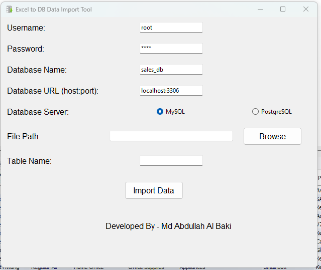

I have developed a small tool using Python for those who work with data and databases. 🎯

# Excel to DB Data Import Tool 

  

### Features:  

1. Easily insert data from CSV and XLSX files into the database.  
2. Supports both MySQL and PostgreSQL databases.  
3. Works with both local and remote databases.  
4. Remembers database details automatically for future use.  
5. Allows you to set custom table names.  
6. Automatically detects data types and sets the schema accordingly.  

### Usage:  
- First, go to the GitHub repository and download the files from the Releases section.  
- Then, click on the software file to start using it.  

Download Link: https://github.com/abdullahal-baki/excel-to-db/releases

Official Channel: https://t.me/BakiSoftLabs  
Chat Group: https://t.me/BakiSoftLabschat

